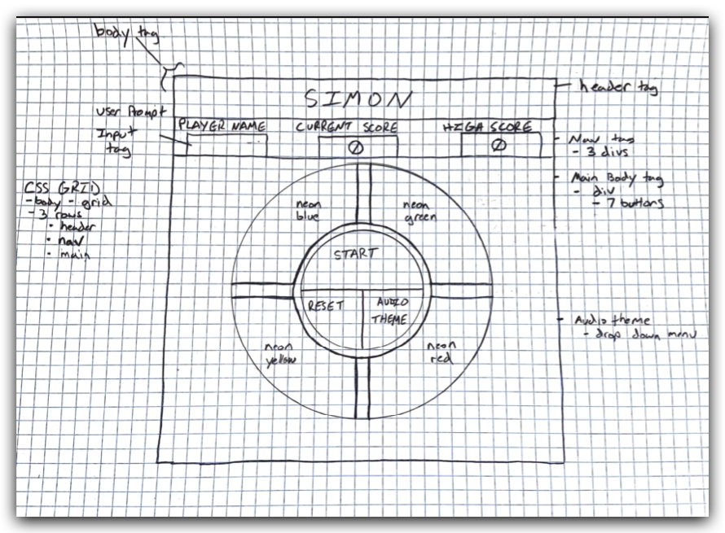
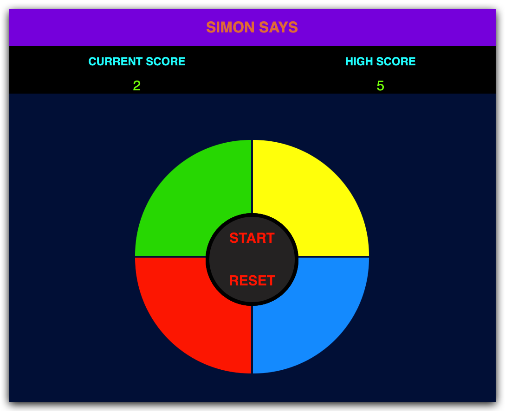

# Simon Game

The Simon game is one of challenging a players memory retention. If you match more than 5 of Simons sequence you level.
For each consecutive level there will be an additional 5 more sequences to memorize!

## Wireframe ScreenShot
<!--  -->

## Technologies Used
- JavaScript
- HTML
- CSS

## Getting Started
- Press the "start" button to begin game play.
- When you lose you will be prompted with what level you accomplished and your score.
- The "start" button will hold your current "high score" and reset your "current score".
- The "reset" button will restart the game with 0 for "high score" and "current score". 

## Next Steps
1. Create a 'player name' field with input functionality.
2. Add sound to the Simon buttons. 
3. Create a menu which allows a player to choose different sound themes.
4. Create different levels of difficulty.